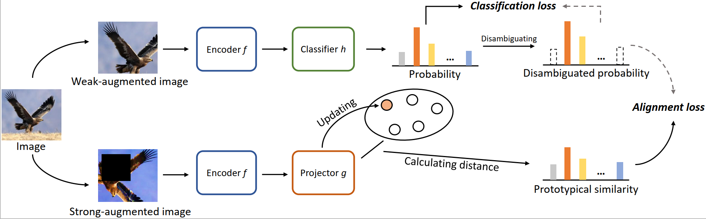

# Towards Effective Visual Representations for Partial-Label Learning



This is a [PyTorch](http://pytorch.org) implementation of **CVPR 2023** paper [**PaPi**](https://arxiv.org/abs/2305.06080). 

**Title:** Towards Effective Visual Representations for Partial-Label Learning

**Authors:** Shiyu Xia, Jiaqi Lv, Ning Xu, Gang Niu, Xin Geng 

**Affliations:** Southeast University, RIKEN Center for Advanced Intelligence Project

If you use this code for a paper, please **cite**:

```
@inproceedings{
  xia2023papi,
  title={Towards Effective Visual Representations for Partial-Label Learning},
  author={S. Xia, J. Lv, N. Xu, G. Niu, and X. Geng},
  booktitle={Proceedings of 36th IEEE/CVF Conference on Computer Vision and Pattern Recognition},
  year={2023}
}
```


## Running PaPi

We provide the following shell codes for PaPi running. 

**Getting started**

- Create directory `./data` (if `./data` does not exist)
- Download and unpack data to `./data`
- Create directory `./pmodel` (if `./pmodel` does not exist)
- Download models in [pmodel1](https://drive.google.com/drive/folders/1wh0a2hZTa6Gg8hhqvEz3um6YTq0fr19g?usp=sharing) to `./pmodel`


**Start Running**
<details>

<summary>
Run Fashion-MNIST with q=0.1, 0.3, 0.5, 0.7 and instance-dependent partial labels
</summary>

```shell
python -u main.py --exp-type 'rand' --exp-dir './experiment/fmnist_rand_0.1' --dataset fmnist --data-dir '../data' --num-class 10 --tau_proto 1.0 --alpha_mixup 8.0 --dist-url 'tcp://localhost:12318' --multiprocessing-distributed --cuda_VISIBLE_DEVICES '0' --world-size 1 --rank 0 --seed 123 --arch resnet18 --workers 0 --lr 0.05 --wd 1e-3 --cosine --epochs 500 --batch-size 256 --alpha_weight 1.0 --partial_rate 0.1


python -u main.py --exp-type 'rand' --exp-dir './experiment/fmnist_rand_0.3' --dataset fmnist --data-dir '../data' --num-class 10 --tau_proto 1.0 --alpha_mixup 0.05 --dist-url 'tcp://localhost:12319' --multiprocessing-distributed --cuda_VISIBLE_DEVICES '0' --world-size 1 --rank 0 --seed 123 --arch resnet18 --workers 0 --lr 0.05 --wd 1e-4 --cosine --epochs 500 --batch-size 256 --alpha_weight 1.0 --partial_rate 0.3


python -u main.py --exp-type 'rand' --exp-dir './experiment/fmnist_rand_0.5' --dataset fmnist --data-dir '../data' --num-class 10 --tau_proto 1.0 --alpha_mixup 5.0 --dist-url 'tcp://localhost:12320' --multiprocessing-distributed --cuda_VISIBLE_DEVICES '0' --world-size 1 --rank 0 --seed 123 --arch resnet18 --workers 0 --lr 0.05 --wd 1e-3 --cosine --epochs 500 --batch-size 256 --alpha_weight 1.0 --partial_rate 0.5


python -u main.py --exp-type 'rand' --exp-dir './experiment/fmnist_rand_0.7' --dataset fmnist --data-dir '../data' --num-class 10 --tau_proto 1.0 --alpha_mixup 5.0 --dist-url 'tcp://localhost:12321' --multiprocessing-distributed --cuda_VISIBLE_DEVICES '0' --world-size 1 --rank 0 --seed 123 --arch resnet18 --workers 0 --lr 0.05 --wd 1e-3 --cosine --epochs 500 --batch-size 256 --alpha_weight 1.0 --partial_rate 0.7


python -u main.py --exp-type 'ins' --exp-dir './experiment/fmnist_ins' --dataset fmnist --data-dir '../data' --num-class 10 --tau_proto 1.0 --alpha_mixup 5.0 --dist-url 'tcp://localhost:12409' --multiprocessing-distributed --cuda_VISIBLE_DEVICES '0' --world-size 1 --rank 0 --seed 123 --arch resnet18 --workers 0 --lr 0.05 --wd 1e-3 --cosine --epochs 500 --batch-size 256 --alpha_weight 1.0 --partial_rate 0.0
```

</details>


<details>

<summary>
Run SVHN with q=0.1, 0.3, 0.5, 0.7 and instance-dependent partial labels
</summary>

```shell
python -u main.py --exp-type 'rand' --exp-dir './experiment/SVHN_rand_0.1' --dataset SVHN --data-dir '../data' --num-class 10 --alpha_mixup 0.05 --dist-url 'tcp://localhost:12528' --multiprocessing-distributed --cuda_VISIBLE_DEVICES '0' --world-size 1 --rank 0 --seed 123 --arch resnet18 --workers 0 --lr 0.05 --wd 1e-3 --cosine --epochs 500 --batch-size 256 --alpha_weight 1.0 --partial_rate 0.1


python -u main.py --exp-type 'rand' --exp-dir './experiment/SVHN_rand_0.3' --dataset SVHN --data-dir '../data' --num-class 10 --alpha_mixup 0.05 --dist-url 'tcp://localhost:12533' --multiprocessing-distributed --cuda_VISIBLE_DEVICES '0' --world-size 1 --rank 0 --seed 123 --arch resnet18 --workers 0 --lr 0.07 --wd 1e-3 --cosine --epochs 500 --batch-size 256 --alpha_weight 1.0 --partial_rate 0.3


python -u main.py --exp-type 'rand' --exp-dir './experiment/SVHN_rand_0.5' --dataset SVHN --data-dir '../data' --num-class 10 --alpha_mixup 0.05 --dist-url 'tcp://localhost:12538' --multiprocessing-distributed --cuda_VISIBLE_DEVICES '0' --world-size 1 --rank 0 --seed 123 --arch resnet18 --workers 0 --lr 0.07 --wd 1e-3 --cosine --epochs 500 --batch-size 256 --alpha_weight 1.0 --partial_rate 0.5


python -u main.py --exp-type 'rand' --exp-dir './experiment/SVHN_rand_0.7' --dataset SVHN --data-dir '../data' --num-class 10 --alpha_mixup 0.05 --dist-url 'tcp://localhost:12543' --multiprocessing-distributed --cuda_VISIBLE_DEVICES '0' --world-size 1 --rank 0 --seed 123 --arch resnet18 --workers 0 --lr 0.07 --wd 1e-3 --cosine --epochs 500 --batch-size 256 --alpha_weight 1.0 --partial_rate 0.7


python -u main.py --exp-type 'ins' --exp-dir './experiment/SVHN_ins' --dataset SVHN --data-dir '../data' --num-class 10 --alpha_mixup 0.05 --dist-url 'tcp://localhost:12613' --multiprocessing-distributed --cuda_VISIBLE_DEVICES '0' --world-size 1 --rank 0 --seed 123 --arch resnet18 --workers 0 --lr 0.07 --wd 1e-3 --cosine --epochs 500 --batch-size 256 --alpha_weight 1.0 --partial_rate 0.0
```

</details>


<details>

<summary>
Run CIFAR-10 with q=0.1, 0.3, 0.5, 0.7 and instance-dependent partial labels
</summary>

```shell
python -u main.py --exp-type 'rand' --exp-dir './experiment/cifar10_rand_0.1' --dataset cifar10 --data-dir '../data' --num-class 10 --dist-url 'tcp://localhost:12348' --multiprocessing-distributed --cuda_VISIBLE_DEVICES '0' --world-size 1 --rank 0 --seed 123 --arch resnet18 --workers 0 --lr 0.05 --wd 1e-3 --cosine --epochs 500 --batch-size 256 --alpha_weight 1.0 --partial_rate 0.1


python -u main.py --exp-type 'rand' --exp-dir './experiment/cifar10_rand_0.3' --dataset cifar10 --data-dir '../data' --num-class 10 --dist-url 'tcp://localhost:12353' --multiprocessing-distributed --cuda_VISIBLE_DEVICES '0' --world-size 1 --rank 0 --seed 123 --arch resnet18 --workers 0 --lr 0.05 --wd 1e-3 --cosine --epochs 500 --batch-size 256 --alpha_weight 1.0 --partial_rate 0.3


python -u main.py --exp-type 'rand' --exp-dir './experiment/cifar10_rand_0.5' --dataset cifar10 --data-dir '../data' --num-class 10 --dist-url 'tcp://localhost:12358' --multiprocessing-distributed --cuda_VISIBLE_DEVICES '0' --world-size 1 --rank 0 --seed 123 --arch resnet18 --workers 0 --lr 0.05 --wd 1e-3 --cosine --epochs 500 --batch-size 256 --alpha_weight 1.0 --partial_rate 0.5


python -u main.py --exp-type 'rand' --exp-dir './experiment/cifar10_rand_0.7' --dataset cifar10 --data-dir '../data' --num-class 10 --dist-url 'tcp://localhost:12363' --multiprocessing-distributed --cuda_VISIBLE_DEVICES '0' --world-size 1 --rank 0 --seed 123 --arch resnet18 --workers 0 --lr 0.05 --wd 1e-3 --cosine --epochs 500 --batch-size 256 --alpha_weight 1.0 --partial_rate 0.7


python -u main.py --exp-type 'ins' --exp-dir './experiment/cifar10_ins' --dataset cifar10 --data-dir '../data' --num-class 10 --dist-url 'tcp://localhost:12418' --multiprocessing-distributed --cuda_VISIBLE_DEVICES '0' --world-size 1 --rank 0 --seed 123 --arch resnet18 --workers 0 --lr 0.05 --wd 1e-3 --cosine --epochs 500 --batch-size 256 --alpha_weight 1.0 --partial_rate 0.0
```

</details>


<details>

<summary>
Run CIFAR-100 with q=0.01, 0.05, 0.1, 0.2 and instance-dependent partial labels
</summary>

```shell
python -u main.py --exp-type 'rand' --exp-dir './experiment/cifar100_rand_0.01' --dataset cifar100 --data-dir '../data' --num-class 100 --dist-url 'tcp://localhost:12368' --multiprocessing-distributed --cuda_VISIBLE_DEVICES '0' --world-size 1 --rank 0 --seed 123 --arch resnet18 --workers 0 --lr 0.1 --wd 1e-3 --cosine --epochs 500 --batch-size 256 --alpha_weight 1.0 --partial_rate 0.01


python -u main.py --exp-type 'rand' --exp-dir './experiment/cifar100_rand_0.05' --dataset cifar100 --data-dir '../data' --num-class 100 --dist-url 'tcp://localhost:12373' --multiprocessing-distributed --cuda_VISIBLE_DEVICES '0' --world-size 1 --rank 0 --seed 123 --arch resnet18 --workers 0 --lr 0.1 --wd 1e-3 --cosine --epochs 500 --batch-size 256 --alpha_weight 1.0 --partial_rate 0.05


python -u main.py --exp-type 'rand' --exp-dir './experiment/cifar100_rand_0.1' --dataset cifar100 --data-dir '../data' --num-class 100 --dist-url 'tcp://localhost:12378' --multiprocessing-distributed --cuda_VISIBLE_DEVICES '0' --world-size 1 --rank 0 --seed 123 --arch resnet18 --workers 0 --lr 0.1 --wd 1e-3 --cosine --epochs 500 --batch-size 256 --alpha_weight 1.0 --partial_rate 0.1


python -u main.py --exp-type 'rand' --exp-dir './experiment/cifar100_rand_0.2' --dataset cifar100 --data-dir '../data' --num-class 100 --dist-url 'tcp://localhost:12383' --multiprocessing-distributed --cuda_VISIBLE_DEVICES '0' --world-size 1 --rank 0 --seed 123 --arch resnet18 --workers 0 --lr 0.1 --wd 1e-3 --cosine --epochs 500 --batch-size 256 --alpha_weight 1.0 --partial_rate 0.2


python -u main.py --exp-type 'ins' --exp-dir './experiment/cifar100_ins' --dataset cifar100 --data-dir '../data' --num-class 100 --tau_proto 1.0 --alpha_mixup 5.0 --dist-url 'tcp://localhost:12493' --multiprocessing-distributed --cuda_VISIBLE_DEVICES '0' --world-size 1 --rank 0 --seed 123 --arch resnet18 --workers 0 --lr 0.1 --wd 1e-3 --cosine --epochs 200 --batch-size 256 --alpha_weight 1.0 --partial_rate 0.0
```

</details>


<details>

<summary>
Run CIFAR-100H with q=0.1, 0.3, 0.5, 0.7
</summary>

```shell
python -u main.py --exp-type 'rand' --exp-dir './experiment/cifar100H_rand_0.1' --dataset cifar100 --data-dir '../data' --num-class 100 --dist-url 'tcp://localhost:12368' --multiprocessing-distributed --cuda_VISIBLE_DEVICES '0' --world-size 1 --rank 0 --seed 123 --arch resnet18 --workers 0 --lr 0.1 --wd 1e-3 --cosine --epochs 500 --batch-size 256 --alpha_weight 1.0 --partial_rate 0.1 --hierarchical


python -u main.py --exp-type 'rand' --exp-dir './experiment/cifar100H_rand_0.3' --dataset cifar100 --data-dir '../data' --num-class 100 --dist-url 'tcp://localhost:12373' --multiprocessing-distributed --cuda_VISIBLE_DEVICES '0' --world-size 1 --rank 0 --seed 123 --arch resnet18 --workers 0 --lr 0.1 --wd 1e-3 --cosine --epochs 500 --batch-size 256 --alpha_weight 1.0 --partial_rate 0.3 --hierarchical


python -u main.py --exp-type 'rand' --exp-dir './experiment/cifar100H_rand_0.5' --dataset cifar100 --data-dir '../data' --num-class 100 --dist-url 'tcp://localhost:12378' --multiprocessing-distributed --cuda_VISIBLE_DEVICES '0' --world-size 1 --rank 0 --seed 123 --arch resnet18 --workers 0 --lr 0.1 --wd 1e-3 --cosine --epochs 500 --batch-size 256 --alpha_weight 1.0 --partial_rate 0.5 --hierarchical


python -u main.py --exp-type 'rand' --exp-dir './experiment/cifar100H_rand_0.7' --dataset cifar100 --data-dir '../data' --num-class 100 --dist-url 'tcp://localhost:12383' --multiprocessing-distributed --cuda_VISIBLE_DEVICES '0' --world-size 1 --rank 0 --seed 123 --arch resnet18 --workers 0 --lr 0.1 --wd 1e-3 --cosine --epochs 500 --batch-size 256 --alpha_weight 1.0 --partial_rate 0.7 --hierarchical
```

</details>


<details>

<summary>
Run Mini-Imagenet with q=0.01, 0.05, 0.1, 0.2
</summary>

```shell
python -u main.py --exp-type 'rand' --exp-dir './experiment/miniImagenet_rand_0.01' --dataset miniImagenet --data-dir '../data/mini-imagenet/images' --num-class 100 --tau_proto 0.1 --alpha_mixup 5.0 --dist-url 'tcp://localhost:12322' --multiprocessing-distributed --cuda_VISIBLE_DEVICES '0' --world-size 1 --rank 0 --seed 123 --arch resnet18 --workers 0 --lr 0.03 --wd 1e-4 --cosine --epochs 500 --batch-size 64 --alpha_weight 1.0 --partial_rate 0.01


python -u main.py --exp-type 'rand' --exp-dir './experiment/miniImagenet_rand_0.05' --dataset miniImagenet --data-dir '../data/mini-imagenet/images' --num-class 100 --tau_proto 0.1 --alpha_mixup 5.0 --dist-url 'tcp://localhost:12332' --multiprocessing-distributed --cuda_VISIBLE_DEVICES '0' --world-size 1 --rank 0 --seed 123 --arch resnet18 --workers 0 --lr 0.03 --wd 1e-4 --cosine --epochs 500 --batch-size 64 --alpha_weight 1.0 --partial_rate 0.05


python -u main.py --exp-type 'rand' --exp-dir './experiment/miniImagenet_rand_0.1' --dataset miniImagenet --data-dir '../data/mini-imagenet/images' --num-class 100 --tau_proto 0.1 --alpha_mixup 5.0 --dist-url 'tcp://localhost:12342' --multiprocessing-distributed --cuda_VISIBLE_DEVICES '0' --world-size 1 --rank 0 --seed 123 --arch resnet18 --workers 0 --lr 0.03 --wd 1e-4 --cosine --epochs 500 --batch-size 64 --alpha_weight 1.0 --partial_rate 0.1


python -u main.py --exp-type 'rand' --exp-dir './experiment/miniImagenet_rand_0.2' --dataset miniImagenet --data-dir '../data/mini-imagenet/images' --num-class 100 --tau_proto 0.1 --alpha_mixup 5.0 --dist-url 'tcp://localhost:12352' --multiprocessing-distributed --cuda_VISIBLE_DEVICES '0' --world-size 1 --rank 0 --seed 123 --arch resnet18 --workers 0 --lr 0.03 --wd 1e-4 --cosine --epochs 500 --batch-size 64 --alpha_weight 1.0 --partial_rate 0.2
```

</details>


We only resort to **one** single NVIDIA Tesla V100 GPU training. If you would like to use multiple GPUs, please carefully check the code.


## Acknowledgment
J. Lv, M. Xu, L. Feng, G. Niu, X. Geng, and M. Sugiyama. Progressive identification of true labels for partial-label learning. In International Conference on Machine Learning, pages 6500–6510, Virtual Event, July 2020. ACM.

Ning Xu, Congyu Qiao, Xin Geng, and Min-Ling Zhang. Instance-dependent partial label learning. In Advances in Neural Information Processing Systems, Virtual Event, December 2021. MIT Press.

Haobo Wang, Ruixuan Xiao, Yixuan Li, Lei Feng, Gang Niu, Gang Chen, and Junbo Zhao. PiCO: Contrastive label disambiguation for partial label learning. In International Conference on Learning Representations, 2022.

Wu, Dong-Dong, Deng-Bao Wang, and Min-Ling Zhang. Revisiting consistency regularization for deep partial label learning. In International Conference on Machine Learning, 2022.

